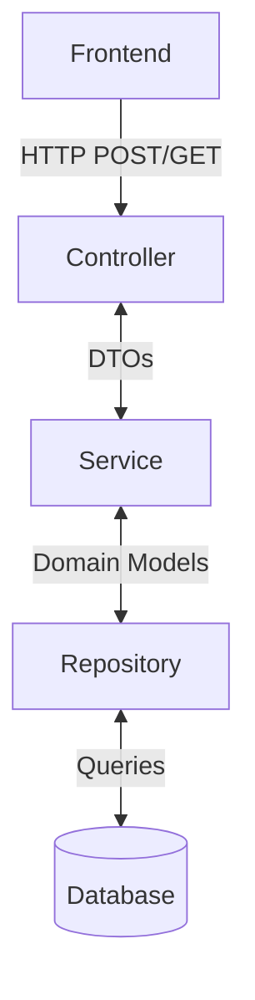

# Patient Management System

A Spring Boot-based Patient Management System designed to efficiently manage patient records and related healthcare information.

## 🏗️ Architecture Overview

The application follows a standard layered architecture with clear separation of concerns:



## 🚀 Getting Started

### Prerequisites

- Java 21 or higher
- Maven 3.6.3 or higher
- PostgreSQL or H2 Database

### Installation

1. Clone the repository:
   ```bash
   git clone https://github.com/yourusername/patient-management.git
   cd patient-management
   ```

2. Configure the database:
   - Create a new PostgreSQL database
   - Update `application.properties` with your database credentials

3. Build the application:
   ```bash
   ./mvnw clean install
   ```

4. Run the application:
   ```bash
   ./mvnw spring-boot:run
   ```

## 📚 API Documentation

Once the application is running, you can access:
- **Swagger UI**: http://localhost:4000/swagger-ui/index.html
- **H2 Console** (if using H2 in-memory DB): http://localhost:4000/h2-console

---

## 🩺 Patient Service Details

### Components

1.  **Controller Layer (`PatientController`)**
    -   Handles HTTP requests/responses and maps endpoints to service methods.
    -   Performs input validation using `@Valid`.

2.  **Service Layer (`PatientService`)**
    -   Contains core business logic and data validation.
    -   Interacts with the repository and throws custom exceptions for business rule violations.

3.  **Repository Layer (`PatientRepository`)**
    -   Extends `JpaRepository` for CRUD operations and provides database access methods.

4.  **Exception Handling (`GlobalExceptionHandler`)**
    -   Uses `@ControllerAdvice` to handle exceptions globally, including validation and custom business exceptions.

5.  **Data Transfer Objects (DTOs)**
    -   `PatientRequestDTO`: For receiving patient data.
    -   `PatientResponseDTO`: For sending patient data.

### API Endpoints

#### 1. Create Patient
- **Endpoint**: `POST /patients`
- **Request Body**: `PatientRequestDTO`
- **Flow**:
  1. Validates the request.
  2. Checks if the email already exists and throws `EmailAlreadyExistsException` if it does.
  3. Saves the new patient to the database.
  4. Returns the created patient as a `PatientResponseDTO`.

#### 2. Get All Patients
- **Endpoint**: `GET /patients`
- **Response**: A list of `PatientResponseDTO`.
- **Flow**:
  1. Retrieves all patients from the database.
  2. Maps the entities to DTOs and returns the list.

### Exception Handling

-   **`MethodArgumentNotValidException`**: Triggered on request validation failure. Returns `400 Bad Request` with field-level errors.
-   **`EmailAlreadyExistsException`**: Triggered when creating a patient with a duplicate email. Returns `400 Bad Request`.

---

## 🛠️ Development

### Project Structure

```
src/main/java/com/company/patientservice/
├── config/           # Configuration classes
├── controller/       # REST controllers
├── dto/              # Data Transfer Objects
├── model/            # Domain models/entities
├── repository/       # Data access layer
├── service/          # Business logic
└── PatientServiceApplication.java  # Application entry point
```

### Building and Testing

- Build the project: `./mvnw clean install`
- Run tests: `./mvnw test`
- Run with custom profile: `./mvnw spring-boot:run -Dspring.profiles.active=dev`

## 🤝 Contributing

1. Fork the repository
2. Create your feature branch (`git checkout -b feature/AmazingFeature`)
3. Commit your changes (`git commit -m 'Add some AmazingFeature'`)
4. Push to the branch (`git push origin feature/AmazingFeature`)
5. Open a Pull Request

## 📄 License

This project is licensed under the MIT License - see the [LICENSE](LICENSE) file for details.

## 🙏 Acknowledgments

- Spring Boot Team
- Open Source Community
