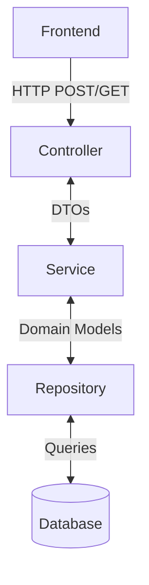

# Patient Management System

A Spring Boot-based Patient Management System designed to efficiently manage patient records and related healthcare information.

## 🏗️ Architecture Overview

The application follows a standard layered architecture with clear separation of concerns:



### Components

1. **Frontend (Client)**
   - Initiates HTTP requests to the backend
   - Sends and receives data in JSON format
   - Handles user interface interactions

2. **Controller Layer**
   - Entry point for all HTTP requests
   - Handles request/response mapping
   - Converts between DTOs and domain models
   - Manages HTTP status codes and error responses

3. **Service Layer**
   - Contains business logic
   - Manages transactions
   - Handles data validation
   - Converts between DTOs and domain models
   - Orchestrates calls to repositories

4. **Repository Layer**
   - Handles data access logic
   - Communicates with the database
   - Implements CRUD operations
   - Manages database transactions

5. **Database**
   - Stores application data
   - Handles data persistence
   - Ensures data integrity

## 🚀 Getting Started

### Prerequisites

- Java 17 or higher
- Maven 3.6.3 or higher
- MySQL 8.0 or higher (or your preferred database)

### Installation

1. Clone the repository:
   ```bash
   git clone https://github.com/yourusername/patient-management.git
   cd patient-management
   ```

2. Configure the database:
   - Create a new MySQL database
   - Update `application.properties` with your database credentials

3. Build the application:
   ```bash
   ./mvnw clean install
   ```

4. Run the application:
   ```bash
   ./mvnw spring-boot:run
   ```

## 📚 API Documentation

Once the application is running, you can access:
- **Swagger UI**: http://localhost:8080/swagger-ui.html
- **H2 Console** (if using H2 in-memory DB): http://localhost:8080/h2-console

## 🛠️ Development

### Project Structure

```
src/main/java/com/company/patientservice/
├── config/           # Configuration classes
├── controller/       # REST controllers
├── dto/              # Data Transfer Objects
├── model/            # Domain models/entities
├── repository/       # Data access layer
├── service/          # Business logic
└── PatientServiceApplication.java  # Application entry point
```

### Building and Testing

- Build the project: `./mvnw clean install`
- Run tests: `./mvnw test`
- Run with custom profile: `./mvnw spring-boot:run -Dspring.profiles.active=dev`

## 🤝 Contributing

1. Fork the repository
2. Create your feature branch (`git checkout -b feature/AmazingFeature`)
3. Commit your changes (`git commit -m 'Add some AmazingFeature'`)
4. Push to the branch (`git push origin feature/AmazingFeature`)
5. Open a Pull Request

## 📄 License

This project is licensed under the MIT License - see the [LICENSE](LICENSE) file for details.

## 🙏 Acknowledgments

- Spring Boot Team
- Open Source Community
